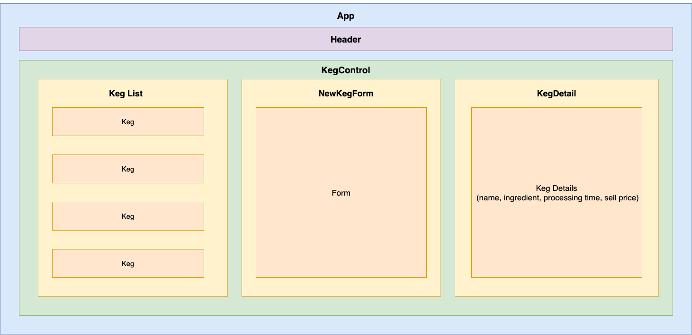

# Tap Room Redux

## By Mekinsie Callahan

* * *

## Description

Tap Room is a <a href="https://stardewvalleywiki.com/Stardew_Valley_Wiki">Stardew Valley</a> themed application that allows users to keep track of their kegs. Users can add kegs and sell pints on the detail page. The purpose of this application is to practice using Redux with React.

* * *

## Technologies used

* React
* npm
* babel
* JSX
* CSS
* Redux

* * *
## Component Diagram


* * *

## Software Requirements
* **npm is required to run this application** 

 <a href="https://www.npmjs.com/get-npm">Install npm here</a>  

* * *

## Installation Instructions
1. Navigate to the desired directory where you would like to clone the project.

2. Once you have chosen your desired directory, clone the github repo using the version control tool `git` (<a href="https://www.learnhowtoprogram.com/introduction-to-programming/getting-started-with-intro-to-programming/git-and-github">download instructions</a>). Type the following command into your terminal:
```bash
$ git clone https://github.com/mekinsie/tap-room
```
3. Open the project in VSCode by typing the following in your terminal:

``` bash
$ code .
```
_**Note:** VSCode is a code editing software. If you don't already have it, you can download it <a href="https://code.visualstudio.com/">here</a>_

4. To start a local server, type the following into your terminal:
```
$ npm start
```
5. Open your default browser and type "localhost:3000" into the search bar and press enter. Here, you will see the live server.

* * *

## License

> [GPLv3](https://choosealicense.com/licenses/gpl-3.0/)\
> Mekinsie Callahan &copy; 2021  
* * *

## Contact Information

Reach me via <a href="https://www.linkedin.com/in/mekinsie/" target="_blank">LinkedIn</a> or <a href="mailto:mekinsie.aja@gmail.com" target="_blank">email</a></li>.  
